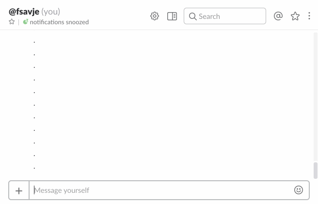

# Rendered math (MathJax) with Slack's desktop client

> :bangbang: MathJax will discontinue its CDN service on April 30. The script has been updated with a new CDN (from Cloudflare). If you downloaded the script before April 5, you will need to download and run the new version.

[Slack](https://slack.com) does not display rendered math. This script injects [MathJax](https://www.mathjax.org) into Slack's desktop client, which allows you to write nice-looking inline- and display-style math using familiar TeX/LaTeX syntax. You can also edit equations after you've posted them.





## How do I install it?

Download your platform's script and run it. After restarting the Slack client, you're all done! (It takes up to 30 seconds for MathJax to load when Slack starts, so be patient.)


### Mac and Linux

Run the following in a terminal:

```shell
curl -OL https://github.com/fsavje/math-with-slack/releases/download/r/math_with_slack.sh
sudo bash math_with_slack.sh
```


### Windows

[Download this script](https://github.com/fsavje/math-with-slack/releases/download/r/math_with_slack.bat) and doubleclick to run. Alternatively, run it in the command prompt with:

```shell
math_with_slack.bat
```

 (You'll most likely get a security warning from Windows since the script was downloaded from Internet.)


### Updating Slack

When you update the Slack app, it might overwrite the code injected by the script. If the client stops rendering math after an update, re-run the script as above and it should work again.


### If Slack cannot be found

If you've installed Slack in some exotic place, the script might not find the installation by itself and you need to specify the location of Slack's `index.js` file as a parameter. E.g., like this on Mac and Linux:

```shell
sudo bash math_with_slack.sh /My_Apps/Slack.app/Contents/Resources/app.asar.unpacked/src/static/index.js
```

and like this on Windows:

```shell
math_with_slack.bat E:\My_Apps\slack\app-2.5.1\resources\app.asar.unpacked\src\static\index.js
```


## How do I get my math rendered?

As you do in TeX, use `$ ... $` for inline math and `$$ ... $$` for display-style math. If you need to write a lot of dollar-signs in a message and want to prevent rendering, use backslash to escape them: `\$`.

Note that only users with MathJax injected in their client will see the rendered version of your math. Users with the standard client will see the equations just as you wrote them (i.e., unrendered including the dollar signs).


## How does it work?

The script alters how Slack is loaded. Under the hood, the desktop client is based on ordinary web technology. The modified client loads the [MathJax library](https://www.mathjax.org) after start-up and adds a listener for messages. As soon as it detects a new message, it looks for TeX-styled math and tries to render. Everything is done in the client; messages are *never* sent to any server for rendering.


## Can I contribute?

Yes, please. Just add an [issue](https://github.com/fsavje/math-with-slack/issues) or a [pull request](https://github.com/fsavje/math-with-slack/pulls).


**Thanks to past contributors:**

* [Caster](https://github.com/Caster)
* [crstnbr](https://github.com/crstnbr)
* [peroxyacyl](https://github.com/peroxyacyl) 


**References and inspiration**

This [comment](https://gist.github.com/DrewML/0acd2e389492e7d9d6be63386d75dd99#gistcomment-1981178) by [jouni](https://github.com/jouni) was extremely helpful. So was this [snippet](https://gist.github.com/etihwnad/bc63ec9b87af586e1435) by [etihwnad](https://github.com/etihwnad).
